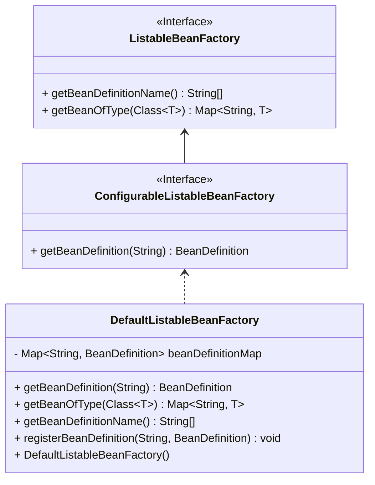

众所周知，Spring通过BeanPostProcess与BeanFactoryPostProcess实现了对IOC容器的扩展

## 一，什么是BeanPostProcessor

BeanPostProcessor的实现包括两个部分，分别为`postProcessBeforeInitialization`前置增强与`postProcessAfterInitialzation`后置增强二者来实现的。

至于BeanPostProcessor的前置/后置增强是在哪里实现的呢，我们可以看一下下面的代码

```java
private Object doCreateBean(String beanName, BeanDefinition beanDefinition) throws BeanException {  
  
  
    // 通过反射创建对象  
    Object bean = null;  
    try {  
        // 通过InstantiationStrategy实例化Bean  
        bean = createBeanInstance(beanDefinition);  
  
        // 为Bean的属性进行赋值  
        applyPropertyValues(bean , beanDefinition , beanName);  
  
        // 执行bean的初始化方法和BeanPostProcessor的前置和后置处理方法  
        initializeBean(beanName , bean);  
    } catch (Exception e) {  
        throw new BeanException(e.getMessage());  
    }  
  
    // 创建完毕后加入缓存  
    super.addSingletonBean(beanName, bean);  
  
    return bean;  
}
```

```java
private void initializeBean(String beanName, Object bean) {  
    // 执行初始化之前的BeanPostProcessor前置处理  
    Object wrappedBean  = applyBeanPostProcessorsBeforeInitialization(bean, beanName);  
  
    // 执行初始化方法  
  
    // 执行初始化之前的BeanPostProcessor后置  
    wrappedBean = applyBeanPostProcessorsAfterInitialization(bean , beanName);  
  
}
```

可以看出在createBean的过程当中会执行BeanPostProcess的增强，那么对于我们所有的Bean来说在经历生命周期的过程当中都需要通过createBean这个方法，也就是说BeanPostProcess是一个全局处理器，它会对容器中所有的Bean的初始化过程进行拦截处理，而不仅仅是你想要增强的特定Bean。

## 二，如何实现BeanPostProcess

首先我们需要定义一个BeanPostProcessor ，用于在 Spring 容器中 Bean 的初始化前后进行自定义处理。

```java
public interface BeanPostProcessor {  
  
    /**  
     * 在 Bean 初始化之前执行自定义处理逻辑。  
     *  
     * @param bean     当前正在初始化的 Bean 实例。  
     * @param beanName 当前 Bean 的名称。  
     * @return 返回处理后的 Bean 实例，可以是原始 Bean 或修改后的 Bean。  
     */  
    Object postProcessBeforeInitialization(Object bean , String beanName);  
  
    /**  
     * 在 Bean 初始化之后执行自定义处理逻辑。  
     *  
     * @param bean     当前已经初始化的 Bean 实例。  
     * @param beanName 当前 Bean 的名称。  
     * @return 返回处理后的 Bean 实例，可以是原始 Bean 或修改后的 Bean。  
     */  
    Object postProcessAfterInitialization(Object bean , String beanName);  
}
```

那在前面说过了BeanPostProcessor是一个全局处理器，会对所有的Bean进行拦截，那么我们在实现这个接口自定义增强逻辑的时候就需要通过If进行判断，筛选我们需要增强的Bean。那么新的问题也就有了，BeanPostProcessor可能不止一个，而是会有多个，因为我们可能需要对多个Bean进行增强，从而定义多个BeanPostProcessor的实现类，这就有需要我们一个容器来保存这些实现。

而这个容器实际上就是`AbstractBeanFactory`

```java
public abstract class AbstractBeanFactory extends DefaultSingletonBeanRegistry implements ConfigurableBeanFactory {  
  
    /**  
     * BeanPostProcess是对指定Bean的增强，可以定义多个processors  
     */    
     private final List<BeanPostProcessor> beanPostProcessors  = new ArrayList<>();  
  
    /**  
     * 添加beanPostProcessor  
     * @param beanPostProcessor     
     */    @Override  
    public void addBeanPostProcessor(BeanPostProcessor beanPostProcessor) {  
        this.beanPostProcessors.add(beanPostProcessor);  
    }  
  
    public List<BeanPostProcessor> getBeanPostProcessors(){  
        return this.beanPostProcessors;  
    }  
  
    /**  
     * 获取Bean  
     * 包含创建Bean的流程，在创建Bean的流程当中会先从缓存当中取，如果没有则创建  
     * 在获取Bean之前需要获取到Bean的定义信息也就是BeanDefinition  
     * 1，从缓存当中获取Bean  
     * 2，尝试创建Bean并返回  
     *  
     * @param beanName Bean名称  
     */  
    @Override  
    public Object getBean(String beanName) {  
        // 尝试从缓存当中获取Bean  
        Object bean = super.getSingletonBean(beanName);  
        if (bean != null){  
            return bean;  
        }  
  
        // 如果没有尝试创建Bean,Bean的创建需要通过BeanDefinition  
        BeanDefinition beanDefinition = getBeanDefinition(beanName);  
  
        // 创建Bean  
        return createBean(beanName , beanDefinition);  
  
    }  
  
  
    protected abstract Object createBean(String beanName, BeanDefinition beanDefinition);  
  
    protected abstract BeanDefinition getBeanDefinition(String beanName) ;  
  
  
}
```


由于我们的`AbstractAutowireCapableBeanFactory`是继承于`AbstractBeanFactory`的，所以在AbstractAutowireCapableBeanFactory当中也拥有相关获取`postProcessor`的方法，这样就可以在其中实现对Bean的增强了。

当然只是这样还不够，我们还需要进行一些处理，由于`AbstractBeanFactory`提供的只是获取当前所有的BeanPostPostProcess方法，我们还需要将BeanPostPostProcess从列表当中取出然后执行其相应的方法逻辑。在这部分操作是通过继承`AutowireCapableBeanFactory`这个类实现的

```java
/**  
 * 执行具体创建Bean的逻辑  
 *  
 * 如何创建Bean？  
 * 通过beanDefinition当中保存的Bean的Class对象，通过反射的方式创建Bean  
 */private Object doCreateBean(String beanName, BeanDefinition beanDefinition) throws BeanException {  
  
  
    // 通过反射创建对象  
    Object bean = null;  
    try {  
        // 通过InstantiationStrategy实例化Bean  
        bean = createBeanInstance(beanDefinition);  
  
        // 为Bean的属性进行赋值  
        applyPropertyValues(bean , beanDefinition , beanName);  
  
        // 执行bean的初始化方法和BeanPostProcessor的前置和后置处理方法  
        initializeBean(beanName , bean);  
    } catch (Exception e) {  
        throw new BeanException(e.getMessage());  
    }  
  
    // 创建完毕后加入缓存  
    super.addSingletonBean(beanName, bean);  
  
    return bean;  
}  
  
private void initializeBean(String beanName, Object bean) {  
    // 执行初始化之前的BeanPostProcessor前置处理  
    Object wrappedBean  = applyBeanPostProcessorsBeforeInitialization(bean, beanName);  
  
    // 执行初始化方法  
  
    // 执行初始化之前的BeanPostProcessor后置  
    wrappedBean = applyBeanPostProcessorsAfterInitialization(bean , beanName);  
  
}


/**  
 * 在Bean初始化之前执行BeanPostProcessors的增强方法  
 *  
 * @param existingBean 当前已经存在的Bean实例  
 * @param beanName     Bean的名称  
 * @return 经过所有BeanPostProcessors处理后的Bean实例  
 */  
@Override  
public Object applyBeanPostProcessorsBeforeInitialization(Object existingBean, String beanName) {  
    Object result = existingBean;  
    List<BeanPostProcessor> beanPostProcessors = super.getBeanPostProcessors();  
    for (BeanPostProcessor postProcessor : beanPostProcessors) {  
        Object current = postProcessor.postProcessBeforeInitialization(result, beanName);  
        if (current == null){  
            return result;  
        }  
        result = current;  
    }  
    return result;  
}  
  
/**  
 * 在Bean初始化之后执行BeanPostProcessors增强方法  
 *  
 * @param existingBean 当前已经存在的Bean实例  
 * @param beanName     Bean的名称  
 * @return 经过所有BeanPostProcessors处理后的Bean实例  
 */  
@Override  
public Object applyBeanPostProcessorsAfterInitialization(Object existingBean, String beanName) {  
    Object result = existingBean;  
    List<BeanPostProcessor> beanPostProcessors = super.getBeanPostProcessors();  
    for (BeanPostProcessor postProcessor : beanPostProcessors) {  
        Object current = postProcessor.postProcessAfterInitialization(result, beanName);  
        if (current == null){  
            return result;  
        }  
        result = current;  
    }  
    return result;  
}
```


在这里还有一个细节，Spring 官方的设计约定中，如果某个 `BeanPostProcessor` 返回了 `null`，代表它放弃了处理该 Bean，并且会中断后续处理器的调用。

也就是说：

- 并不是把 `null` 作为“没处理”来对待；
- 而是 `null` 被**视为处理失败或者拒绝处理**；
- 为了防止后续处理器再继续处理一个 `null` Bean，**Spring 会立刻中断链条**，返回当前处理结果。

比如你实现了一个处理器：

```java
public class MyBeanPostProcessor implements BeanPostProcessor {
    @Override
    public Object postProcessBeforeInitialization(Object bean, String beanName) {
        if (bean instanceof SpecialBean) {
            return null; // 我不想让这个 Bean 继续初始化
        }
        return bean;
    }
}

```

你这里的意图很可能是：

> “如果是 `SpecialBean`，我不允许它继续走后续的 Bean 初始化流程。”

这个时候如果不判断 `null` 而直接把它传给下一个处理器，后面的处理器就会收到 `null`，有可能会抛出 `NullPointerException`，更糟的是：**你本来是想中断初始化流程，结果还在继续处理，这就违背了初衷。**

现在来测试一下，我们只需要定义一个类去实现BeanPostProcessor然后对我们需要增强的Bean进行操作即可，之后将该类加入AbstractBeanFactory，就会在创建Bean的时候进行拦截了

```java
  
public class CustomerBeanPostProcessor implements BeanPostProcessor {  
    /**  
     * 在 Bean 初始化之前执行自定义处理逻辑。  
     *  
     * @param bean     当前正在初始化的 Bean 实例。  
     * @param beanName 当前 Bean 的名称。  
     * @return 返回处理后的 Bean 实例，可以是原始 Bean 或修改后的 Bean。  
     */  
    @Override  
    public Object postProcessBeforeInitialization(Object bean, String beanName) {  
        if (beanName.equals("people")) {  
            System.out.println("CustomerBeanPostProcessor.postProcessBeforeInitialization()");  
            People people = (People) bean;  
            people.setName("customer");  
            return people;  
        }  
        return bean;  
  
    }  
  
    /**  
     * 在 Bean 初始化之后执行自定义处理逻辑。  
     *  
     * @param bean     当前已经初始化的 Bean 实例。  
     * @param beanName 当前 Bean 的名称。  
     * @return 返回处理后的 Bean 实例，可以是原始 Bean 或修改后的 Bean。  
     */  
    @Override  
    public Object postProcessAfterInitialization(Object bean, String beanName) {  
        return null;  
    }  
}
```

```java
  
/**  
 * 测试BeanPostProcessor的功能。  
 * 该方法通过加载Spring配置文件，注册自定义的BeanPostProcessor，并获取Bean实例，  
 * 验证BeanPostProcessor是否能够对Bean进行后置处理。  
 */  
@Test  
public void testBeanPostPostProcess() {  
    // 创建默认的BeanFactory实例  
    DefaultListableBeanFactory factory = new DefaultListableBeanFactory();  
  
    // 创建XML Bean定义读取器，并加载指定的Spring配置文件  
    XmlBeanDefinitionReader xmlBeanDefinitionReader = new XmlBeanDefinitionReader(factory);  
    xmlBeanDefinitionReader.loadBeanDefinitions("classpath:spring.xml");  
  
    // 向BeanFactory注册自定义的BeanPostProcessor  
    factory.addBeanPostProcessor(new CustomerBeanPostProcessor());  
  
    // 从BeanFactory中获取名为"people"的Bean实例，并打印其内容  
    People people = (People) factory.getBean("people");  
    System.out.println(people);  
}
```


## 三，什么是BeanFactoryPostProcess

前面说过了BeanPostProcessors是在创建Bean的过程当中对Bean进行全局增强，那么BeanFactoryPostProcess则是对整个容器进行增强。
单独这样讲会有点抽象，在这里我们可以思考一下BeanFactory是用来干什么的，很简单是用来管理Bean的整个生命周期。
那么BeanFactoryPostProcess也是可以对所有的Bean进行增强，那么如何操作所有的Bean？
很简单获取到BeanDefinitionMap就行了，因为Bean的定义信息都保存在这个Map当中，而BeanDefinition又是Bean创建的依据，通过BeanDefinition就可以去操作Bean的行为。


我们可以把Spring容器想象成一个大型的"Bean工厂"，而BeanFactory就是这个工厂的"总控制台"。


1. **BeanDefinitionMap - 工厂的原料配方库**
   - 就像工厂里存放所有产品配方的文件柜(Map)
   - 每个配方(BeanDefinition)详细记录了：
     * 要生产什么产品(Bean的class)
     * 需要什么原料(依赖项)
     * 生产工艺(属性值、初始化方法等)

2. **BeanFactoryPostProcessor - 配方调整专家**
   - 这位专家可以在产品正式生产前，对所有配方进行统一调整：
     * 修改现有配方(修改BeanDefinition)
     * 添加新配方(注册新的BeanDefinition)
     * 删除不合格配方(移除BeanDefinition)

3. **操作方式 - 直接访问配方库**
   ```java
   public void postProcessBeanFactory(ConfigurableListableBeanFactory beanFactory) {
       // 获取配方库(BeanDefinitionMap)的访问权限
       if (beanFactory instanceof DefaultListableBeanFactory) {
           DefaultListableBeanFactory dlbf = (DefaultListableBeanFactory) beanFactory;
           
           // 获取所有配方名称
           String[] beanNames = dlbf.getBeanDefinitionNames();
           
           for (String beanName : beanNames) {
               // 取出具体配方
               BeanDefinition bd = dlbf.getBeanDefinition(beanName);
               
               // 修改配方 - 比如改变产品的默认颜色
               if(bd.getPropertyValues().contains("color")) {
                   bd.getPropertyValues().add("color", "red");
               }
           }
       }
   }
   ```


1. **为什么能影响所有Bean？**
   - 因为操作的是"源头配方"(BeanDefinition)
   - 就像修改了汽车设计图，之后生产的所有汽车都会受到影响

2. **与BeanPostProcessor的区别**
   - BeanPostProcessor像是"质检员"，对已经生产出来的产品(Bean实例)进行后期加工
   - BeanFactoryPostProcessor是"设计总监"，在生产前修改设计图纸


这种"源头控制"的方式使得BeanFactoryPostProcessor成为Spring容器扩展中最强大的工具之一，它让我们能在Bean实例化之前就对整个应用的行为进行深度定制。


## 四，如何实现BeanFactoryPostProcessor

前面理解了BeanFactoryPostProcessor是干什么的，那么现在要来实现它也很容易，只需要提供一个接口，在接口当中定义一个方法将我们的BeanFactory作为方法参数传入进去即可

这样就可以在实现类当中获取BeanFactory从而操作BeanDefinition。当然这里并不是直接传入BeanFactory而是我们抽取了一个子类来实现它，该类当中包含有对BeanDefinition操作的各种方法


我们来看一下是如何抽取的，通俗的说我们又抽取了ListableBeanFactory这个分支用来处理BeanFactoryPostProcess也就是对BeanDefinition操作的相关逻辑。



```java
public interface ListableBeanFactory extends BeanFactory {  
  
    /**  
     * 根据指定的类型获取所有符合条件的Bean实例，并以Map形式返回。  
     * Map的键为Bean的名称，值为对应的Bean实例。  
     *  
     * @param type 要查找的Bean类型  
     * @param <T>  Bean的泛型类型  
     * @return 包含所有符合类型条件的Bean实例的Map，键为Bean名称，值为Bean实例  
     */  
    <T> Map<String, T> getBeanOfType(Class<T> type);  
  
    /**  
     * 获取当前BeanFactory中所有Bean定义的名称。  
     *  
     * @return 包含所有Bean定义名称的字符串数组  
     */  
    String[] getBeanDefinitionName();  
}
```

```java
public interface ConfigurableListableBeanFactory extends ListableBeanFactory {  
  
    // 该接口目前没有定义具体的方法，但通常用于扩展 Bean 工厂的功能，  
    // 例如配置 Bean 的定义、管理 Bean 的生命周期、处理 Bean 的依赖关系等。  
  
    BeanDefinition getBeanDefinition(String beanNane);  
  
}
```

```java
public class DefaultListableBeanFactory extends AbstractAutowireCapableBeanFactory implements BeanDefinitionRegister , ConfigurableListableBeanFactory {  
  
  
    private Map<String , BeanDefinition> beanDefinitionMap = new HashMap<>();  
  
  
  
    /**  
     * 注册BeanDefinition  
     *     * @param beanName     * @param beanDefinition     */    @Override  
    public void registerBeanDefinition(String beanName, BeanDefinition beanDefinition) {  
        beanDefinitionMap.put(beanName,beanDefinition);  
    }  
  
  
    /**  
     * 获取BeanDefinition  
     *     * @param beanName     * @return     */    @Override  
    public BeanDefinition getBeanDefinition(String beanName) {  
        return beanDefinitionMap.get(beanName);  
    }  
  
  
    /**  
     * 根据指定的类型获取所有符合条件的Bean实例，并以Map形式返回。  
     * Map的键为Bean的名称，值为对应的Bean实例。  
     *  
     * @param type 要查找的Bean类型  
     * @return 包含所有符合类型条件的Bean实例的Map，键为Bean名称，值为Bean实例  
     */  
    @Override  
    public <T> Map<String, T> getBeanOfType(Class<T> type) {  
        Map<String, T> result = new HashMap<>();  
        this.beanDefinitionMap.forEach((beanName , beanDefinition)-> {  
            Class beanClass = beanDefinition.getBeanClass();  
            if (type.isAssignableFrom(beanClass)){  
                T bean = (T) getBean(beanName);  
                result.put(beanName,bean);  
            }  
        }) ;  
        return result;  
    }  
  
    /**  
     * 获取当前BeanFactory中所有Bean定义的名称。  
     *  
     * @return 包含所有Bean定义名称的字符串数组  
     */  
    @Override  
    public String[] getBeanDefinitionName() {  
        Set<String> beanDefinitionNames = beanDefinitionMap.keySet();  
        return beanDefinitionNames.toArray(new String[beanDefinitionNames.size()]);  
    }  
}
```

DefaultListableBeanFactory是ConfigurableListableBeanFactory的实现，这样的话我们在BeanFactoryPostProcess当中只需要传入ConfigurableListableBeanFactory即可

现在我们再来实现一下BeanFactoryPostProcess

```java
/**  
 * BeanFactoryPostProcessor 是一个接口，用于在 Spring 容器实例化所有 bean 之后，但在 bean 初始化之前，  
 * 对 BeanFactory 进行后处理。实现该接口的类可以通过 `postProcessBeanFactory` 方法对 BeanFactory 进行自定义的修改或扩展。  
 *  
 * @author: jixu * @create: 2025-04-11 16:36 **/public interface BeanFactoryPostProcessor {  
  
    /**  
     * 对 BeanFactory 进行后处理的方法。该方法在 Spring 容器实例化所有 bean 之后，但在 bean 初始化之前被调用。  
     * 实现类可以通过该方法对 BeanFactory 进行自定义的修改或扩展。  
     *  
     * @param beanFactory 可配置的 BeanFactory 实例，允许对 bean 定义进行修改或扩展。  
     */  
    void postProcessBeanFactory(ConfigurableListableBeanFactory beanFactory);  
}
```

写个测试

```java
public class CustomerBeanFactoryPostProcessor implements BeanFactoryPostProcessor {  
  
    /**  
     * 对 BeanFactory 进行后处理的方法。该方法在 Spring 容器实例化所有 bean 之后，但在 bean 初始化之前被调用。  
     * 实现类可以通过该方法对 BeanFactory 进行自定义的修改或扩展。  
     *  
     * @param beanFactory 可配置的 BeanFactory 实例，允许对 bean 定义进行修改或扩展。  
     */  
    @Override  
    public void postProcessBeanFactory(ConfigurableListableBeanFactory beanFactory) {  
        BeanDefinition beanDefinition = beanFactory.getBeanDefinition("people");  
        PropertyValues propertyValues = beanDefinition.getPropertyValues();  
        propertyValues.addPropertyValue(new PropertyValue("name","ji"));  
    }  
}
```

```java
@Test  
public void testBeanFactoryPostProcess() {  
    // 创建默认的BeanFactory实例  
    DefaultListableBeanFactory factory = new DefaultListableBeanFactory();  
  
    // 创建XML Bean定义读取器，并加载指定的Spring配置文件  
    XmlBeanDefinitionReader xmlBeanDefinitionReader = new XmlBeanDefinitionReader(factory);  
    xmlBeanDefinitionReader.loadBeanDefinitions("classpath:spring.xml");  
  
    People people = (People) factory.getBean("people");  
    System.out.println(people);  
  
    CustomerBeanFactoryPostProcessor customerBeanFactoryPostProcessor = new CustomerBeanFactoryPostProcessor();  
    customerBeanFactoryPostProcessor.postProcessBeanFactory(factory);  
  
    people = (People) factory.getBean("people");  
    System.out.println(people);  
  
  
}
```


## 五，运用到的设计模式

其实整个 `BeanPostProcessor` 的设计融合了责任链模式和策略模式的思想。  
Spring 容器通过在 `AbstractBeanFactory` 中维护一个 `List<BeanPostProcessor>`，将所有处理器组织成一个处理链，并在 `AbstractAutowireCapableBeanFactory` 中通过 `applyBeanPostProcessorsBeforeInitialization` 和 `applyBeanPostProcessorsAfterInitialization` 方法对每个 Bean 实例依次调用这些处理器，完成增强逻辑。这种链式调用体现了责任链模式，而每个处理器内部根据具体的 Bean 类型或特征做出不同增强决策，则体现了策略模式。


###  1. 责任链模式的体现

> **“将beanPostProcessors视为一个调用链，处理符合条件的Bean。”**

这部分是非常典型的**责任链模式（Chain of Responsibility）**应用：

- 每一个 `BeanPostProcessor` 就像是责任链中的一个“处理节点”，

- 它有机会对 Bean 进行处理或放行（即返回原始或修改后的 Bean），

- Spring 会**依次调用**这些处理器，每一个处理器的返回结果会传递给下一个处理器继续处理。


**实现上就是：**

```java
for (BeanPostProcessor postProcessor : beanPostProcessors) {
    result = postProcessor.postProcessBeforeInitialization(result, beanName);
}
```

这条链的核心点是：**所有处理器“串”起来执行，顺序执行，互不干扰但共享上下文（bean 实例）**，是典型的职责链结构。

---

###  2. 策略模式的隐性体现

> **“是一种责任链模式与策略模式的一种实现。”**

虽然**责任链模式是显性的**，**策略模式在这里则是隐含在每个处理器的实现中的**。

每一个 `BeanPostProcessor` 实际上**就是一套针对某类 bean 的处理策略**：

- 比如你实现一个 `LoggingBeanPostProcessor`，它可能只对 `@Service` 类型的 bean 增强。

- 又比如一个 `ProxyBeanPostProcessor`，可能只对实现了某些接口的 bean 创建代理。


这种“策略对象 + 接口约定 + 运行时选择合适策略”的模式，符合策略模式的定义。

### 3. 补充类比：

- **责任链** 决定了“执行顺序”和“流程控制”；

- **策略模式** 决定了“每个节点的处理逻辑”。


